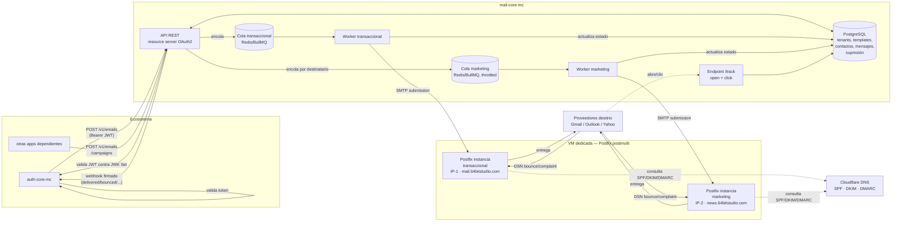
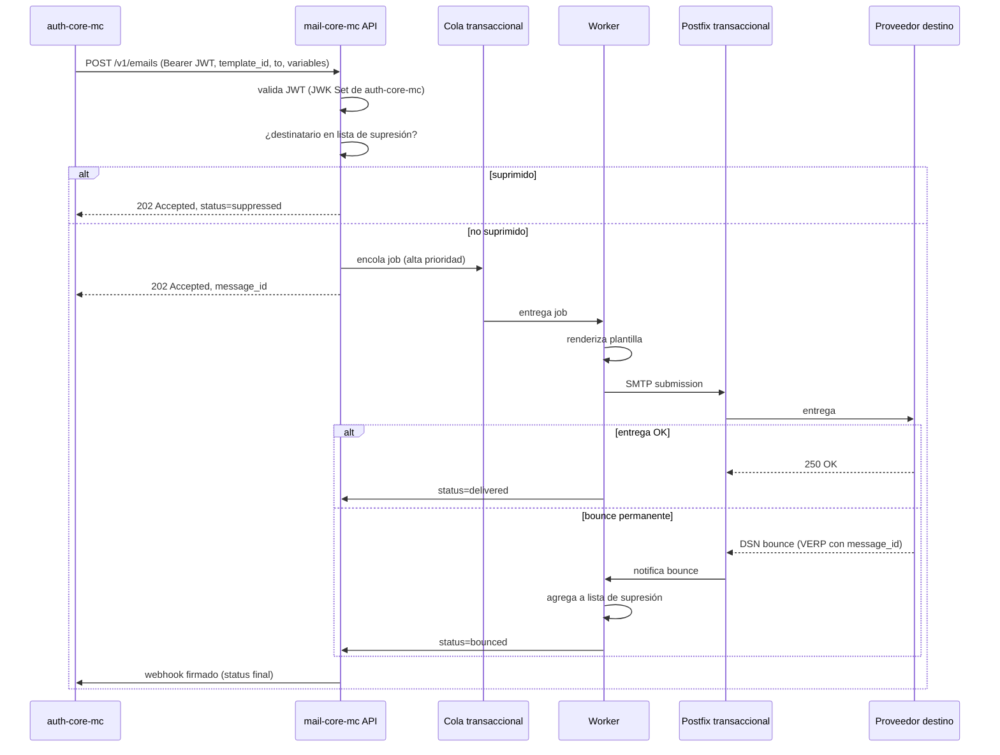
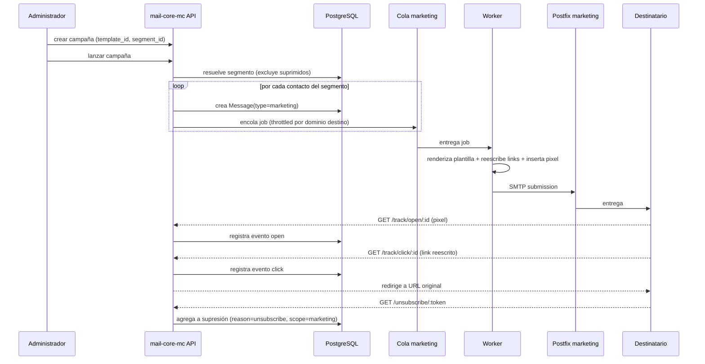
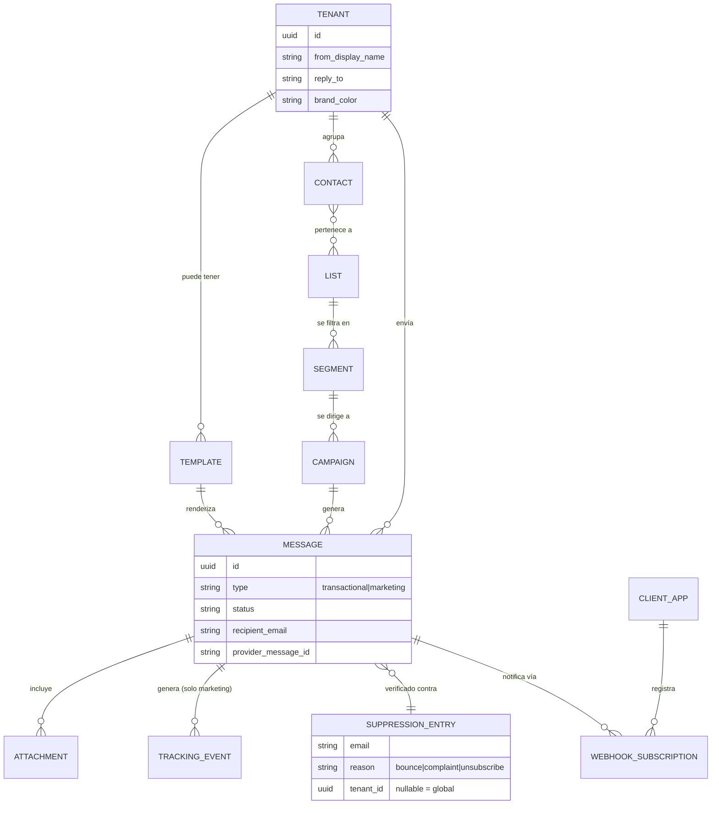

# Definición: mail-core-mc — core propio de envío de correo electrónico

## Resumen ejecutivo

`mail-core-mc` es un nuevo servicio (Node.js/TypeScript) que reemplaza la
dependencia de un proveedor externo de correo (SES/SendGrid/etc.) con
infraestructura propia de envío (Postfix dedicado, dominio propio con
SPF/DKIM/DMARC). Cubre dos frentes desde v1: (1) correo **transaccional**
— lo que hoy necesita `auth-core-mc` para verificación de cuenta, reset de
password y 2FA — y (2) correo **masivo/marketing** con gestión de
contactos, listas, segmentos y campañas. `auth-core-mc` será el primer
consumidor, autenticándose vía OAuth2 (ya es su propio Authorization
Server) y migrando de un solo golpe (cutover, sin fallback) una vez
`mail-core-mc` esté operativo.

## Objetivo de negocio

Dejar de depender de un proveedor externo de correo para el ecosistema
(`auth-core-mc` y las apps que sigan), teniendo control total sobre
entregabilidad, costos y datos de los destinatarios, y sentando una base
reutilizable de envío masivo (marketing) para el resto de apps
dependientes del ecosistema.

**Usuarios/roles involucrados:**
- **Apps del ecosistema** (ej. `auth-core-mc`): consumen la API vía OAuth2
  `client_credentials` para enviar transaccionales y, eventualmente,
  disparar campañas.
- **Administrador de mail-core-mc**: gestiona plantillas, remitentes por
  tenant, contactos/listas/segmentos y campañas.
- **Destinatario final**: recibe el correo; puede abrir, dar clic, marcar
  spam (complaint) o darse de baja (unsubscribe).

## Alcance

### Incluye
- Envío transaccional vía API (template + variables + destinatario).
- Envío masivo/marketing: contactos, listas, segmentos, campañas.
- Motor de plantillas HTML con variables (gestionadas en `mail-core-mc`,
  no en cada app llamante).
- Identidad de remitente por tenant (From display name, reply-to,
  branding) bajo el dominio compartido `64bitstudio.com` — **no** dominios
  propios por tenant (BYO domain queda fuera de v1, ver "No incluye").
- Infraestructura propia de envío: Postfix en VM dedicada, **dos pools
  separados** (transaccional y marketing) con subdominios e IPs distintos
  para aislar reputación.
- Lista de supresión (bounces, complaints, unsubscribe) aplicada
  automáticamente antes de cada envío.
- Adjuntos en correos (transaccionales y de campaña).
- Tracking de aperturas y clics para campañas de marketing.
- Webhooks firmados hacia la app llamante con el estado de entrega
  (delivered/bounced/complained/opened/clicked/unsubscribed).
- Autenticación de las apps llamantes vía OAuth2 `client_credentials`
  contra `auth-core-mc` (resource server en `mail-core-mc`).
- Migración (cutover directo, sin fallback) de `auth-core-mc` a
  `mail-core-mc` para sus correos actuales.

### No incluye
- Dominio de envío propio por tenant (BYO domain con su propio
  SPF/DKIM) — todos los tenants comparten `64bitstudio.com`, solo varía
  el "From" display name/reply-to/branding.
- SMS/push notifications — es exclusivamente correo electrónico.
- Editor visual de plantillas (drag-and-drop tipo builder). v1 recibe
  HTML/Handlebars ya armado, gestionado vía API/panel simple.
- A/B testing de campañas.
- Analítica avanzada de deliverability más allá de opens/clicks/bounces
  básicos (sin dashboards tipo Mailchimp Pro).
- Certificación legal formal de un marco específico (GDPR/CAN-SPAM/etc.)
  — se aplican buenas prácticas genéricas (unsubscribe funcional, no
  reventa de datos, retención razonable), sin comprometerse a un marco
  legal certificado.
- Fallback automático al proveedor externo anterior durante la
  migración — se decidió corte directo (ver Riesgos).

## Historias de Usuario

### Fase 1 — Núcleo transaccional (bloquea el objetivo inmediato de integrar con auth-core-mc)

#### HU-1: Enviar correo transaccional vía API
Como app del ecosistema (ej. auth-core-mc), quiero llamar a un endpoint de
`mail-core-mc` con un `template_id`, variables y un destinatario, para
enviar correos transaccionales sin operar mi propia infraestructura de
correo.

Criterios de aceptación:
- Dado un token OAuth2 válido con scope `mail:send`, cuando hago
  `POST /v1/emails` con `template_id`, `to` y `variables`, entonces recibo
  `202 Accepted` con un `message_id` y el correo queda encolado.
- Dado un `template_id` inexistente, cuando envío la petición, entonces
  recibo `400` con un error claro (no se encola nada).
- Dado un token sin scope `mail:send`, cuando llamo al endpoint, entonces
  recibo `403`.
- Dado un destinatario en la lista de supresión, cuando envío la
  petición, entonces recibo `202` pero el mensaje se marca `suppressed`
  y no se entrega (no falla silenciosamente: el estado es consultable).

#### HU-2: Gestionar plantillas de correo
Como administrador de mail-core-mc, quiero crear/actualizar plantillas
HTML con variables, para poder cambiar el diseño de un correo sin tocar
el código de la app llamante.

Criterios de aceptación:
- Dado un HTML con placeholders (`{{variable}}`), cuando creo una
  plantilla vía API/panel, entonces queda versionada y disponible por
  `template_id`.
- Dado un envío que referencia variables no provistas por el llamante,
  entonces la API responde `400` antes de encolar (falla rápido, no
  silenciosamente con un correo roto).

#### HU-3: Reintentos y backoff ante fallas transitorias de entrega
Como operador del sistema, quiero que un fallo transitorio de SMTP (4xx)
reintente automáticamente con backoff, para no perder correos por una
falla momentánea del MTA destino.

Criterios de aceptación:
- Dado un rechazo SMTP `4xx` (transitorio), cuando el worker procesa el
  job, entonces se reintenta con backoff exponencial hasta N intentos.
- Dado un rechazo SMTP `5xx` (permanente) o que se agoten los reintentos,
  entonces el mensaje pasa a `failed` y se dispara el webhook
  correspondiente — nunca se reintenta indefinidamente.

#### HU-4: Procesar bounces y complaints, actualizar supresión
Como operador del sistema, quiero que un bounce o complaint recibido por
Postfix actualice automáticamente la lista de supresión, para no seguir
enviando a direcciones inválidas o que se quejan de spam.

Criterios de aceptación:
- Dado un hard bounce (DSN permanente), cuando el bounce-processor lo
  detecta, entonces el destinatario entra a la lista de supresión y
  `Message.status = bounced`.
- Dado un complaint (feedback loop), cuando se detecta, entonces el
  destinatario entra a supresión con `reason = complaint`.
- Dado un destinatario ya suprimido, cuando llega un nuevo envío hacia
  él (de cualquier tenant/app), entonces se bloquea antes de encolar.

#### HU-5: Notificar estado de entrega vía webhook
Como app llamante, quiero recibir un webhook firmado cuando cambie el
estado de un correo que envié, para saber si un reset de password
realmente llegó.

Criterios de aceptación:
- Dado un webhook registrado con su `secret`, cuando cambia el estado de
  un mensaje (delivered/bounced/complained/failed), entonces
  `mail-core-mc` hace `POST` al webhook con el payload firmado
  (`X-Signature: HMAC-SHA256`).
- Dado que el endpoint del llamante responde error o timeout, entonces
  el webhook se reintenta con backoff hasta N intentos y luego se
  descarta registrando el fallo (no bloquea el pipeline de envío).

#### HU-6: Autenticación de apps llamantes vía OAuth2
Como app del ecosistema, quiero autenticarme con el mismo mecanismo
OAuth2 que ya uso con `auth-core-mc`, para no gestionar credenciales
adicionales solo para `mail-core-mc`.

Criterios de aceptación:
- Dado un JWT emitido por `auth-core-mc` (client_credentials), cuando lo
  presento como Bearer token, entonces `mail-core-mc` lo valida contra el
  JWK Set de `auth-core-mc` sin necesitar una base de credenciales propia.
- Dado un token expirado o de un `client_id` no autorizado, entonces
  recibo `401`.

#### HU-7: Infraestructura de envío transaccional con dominio y reputación propios
Como operador del sistema, quiero un MTA dedicado con SPF/DKIM/DMARC
configurados en `mail.64bitstudio.com`, para poder entregar correo
directamente sin depender de un proveedor externo.

Criterios de aceptación:
- Dado el subdominio `mail.64bitstudio.com`, cuando se envía un correo de
  prueba, entonces pasa validación SPF, DKIM y DMARC en el destino
  (verificable con herramientas tipo mail-tester).
- Dado el plan de calentamiento de IP, cuando arranca el envío en
  producción, entonces el volumen diario sigue una rampa gradual
  documentada (no todo el volumen esperado desde el día 1).

### Fase 2 — Identidad de remitente multi-tenant

#### HU-8: Configurar remitente/branding por tenant
Como administrador de un tenant en el ecosistema, quiero definir el
nombre de remitente, reply-to y branding de mis correos, para que mis
usuarios reconozcan quién les escribe.

Criterios de aceptación:
- Dado un tenant sin configuración de remitente, entonces se usa un
  remitente/branding por defecto del ecosistema.
- Dado un tenant con `from_display_name`/`reply_to`/branding
  configurados, cuando se envía un correo para ese tenant, entonces el
  correo sale con esos valores bajo el dominio compartido
  `mail.64bitstudio.com`.

### Fase 3 — Correo masivo / marketing (CRM)

#### HU-9: Gestionar contactos y listas
Como administrador de mail-core-mc, quiero crear contactos y agruparlos
en listas, para poder dirigirles campañas.

Criterios de aceptación:
- Dado un contacto nuevo, cuando lo doy de alta (individual o import
  masivo), entonces queda asociado a un tenant y puede pertenecer a
  múltiples listas.
- Dado un contacto en la lista de supresión, cuando se agrega a una
  lista, entonces se marca visualmente como no-enviable, sin bloquear su
  registro (solo bloquea el envío).

#### HU-10: Segmentar contactos
Como administrador de mail-core-mc, quiero definir segmentos (filtros
sobre atributos de contacto) dentro de una lista, para dirigir campañas
a subconjuntos relevantes.

Criterios de aceptación:
- Dado un filtro de segmento (ej. `atributo = valor`), cuando lo aplico
  sobre una lista, entonces obtengo el subconjunto de contactos que
  cumple la condición, excluyendo siempre a los suprimidos.

#### HU-11: Crear y enviar una campaña
Como administrador de mail-core-mc, quiero crear una campaña (plantilla +
segmento) y enviarla, para comunicar algo a un grupo de contactos.

Criterios de aceptación:
- Dado una campaña en `draft` con plantilla y segmento válidos, cuando la
  lanzo, entonces se genera un `Message` por destinatario del segmento
  (excluyendo suprimidos) y se encola en la cola de marketing.
- Dado un envío masivo en curso, entonces se aplica throttling por
  dominio destino (Gmail/Outlook/Yahoo limitan agresivamente IPs/dominios
  nuevos) para proteger la reputación.

#### HU-12: Adjuntar archivos a un correo
Como app llamante o administrador de campaña, quiero adjuntar uno o más
archivos a un correo, para enviar comprobantes/documentos/material de
campaña.

Criterios de aceptación:
- Dado un adjunto dentro del límite de tamaño configurado, cuando se
  envía el correo, entonces llega con el adjunto correctamente
  codificado (MIME).
- Dado un adjunto que excede el límite, entonces la API rechaza la
  petición con `400` antes de encolar.

#### HU-13: Tracking de aperturas y clics
Como administrador de campaña, quiero saber cuántos destinatarios
abrieron el correo o dieron clic en un link, para medir la efectividad
de la campaña.

Criterios de aceptación:
- Dado un correo de campaña enviado, cuando el destinatario lo abre
  (carga el pixel), entonces se registra un evento `open` asociado al
  `message_id`.
- Dado un link dentro del correo, cuando el destinatario da clic,
  entonces se registra un evento `click` con la URL destino y se
  redirige correctamente al destino original.
- Los correos **transaccionales no llevan tracking de apertura/clics**
  (solo aplica a marketing) — evita instrumentar innecesariamente
  correos sensibles como reset de password.

#### HU-14: Unsubscribe / lista de supresión por preferencia
Como destinatario de una campaña, quiero poder darme de baja fácilmente,
para dejar de recibir correos de marketing de ese tenant.

Criterios de aceptación:
- Dado cualquier correo de marketing, entonces incluye un link y un
  header `List-Unsubscribe` funcionales.
- Dado que un destinatario se da de baja, entonces queda en la lista de
  supresión (con `reason = unsubscribe`) y no vuelve a recibir correos de
  marketing de ese tenant — los transaccionales de seguridad (ej. reset
  de password) **no** se ven afectados por un unsubscribe de marketing.

## Diseño técnico

Decisiones tomadas para este documento (rol *architect*), con tradeoffs
explícitos:

**Stack de aplicación: NestJS (Node.js/TypeScript) + PostgreSQL + Redis
(BullMQ) + Prisma.**
El alcance real (envío transaccional + CRM completo de marketing) tiene
suficientes módulos con responsabilidades separadas (envío, plantillas,
contactos/listas/segmentos, campañas, tracking, webhooks, identidad de
remitente) para justificar la estructura modular y la inyección de
dependencias de NestJS, en vez de un Express/Fastify mínimo que
terminaría reinventando esa organización a mano. Prisma da migraciones
versionadas (equivalente en espíritu a Flyway en `auth-core-mc`) con
buena ergonomía en TypeScript. Redis + BullMQ para las colas de envío
(ya hay precedente de Redis en el ecosistema vía `auth-core-mc`).

**Dos pools de envío completamente separados (transaccional vs.
marketing).**
Postfix corre en modo `postmulti` con dos instancias en la misma VM
dedicada, cada una con su propia IP de salida y su propio subdominio:
- `mail.64bitstudio.com` — solo transaccional, cola de alta prioridad.
- `news.64bitstudio.com` — solo marketing, cola con throttling agresivo.

Si una campaña genera quejas de spam o entra en una lista negra, la
reputación de `news.64bitstudio.com` se degrada sin arrastrar a
`mail.64bitstudio.com` — un reset de password sigue entregándose. Esto
requiere que la VM dedicada soporte al menos 2 IPs de salida (**pregunta
abierta de infraestructura**, ver Riesgos).

**Identidad de remitente multi-tenant sin dominio propio por tenant.**
Cada tenant configura `from_display_name`/`reply_to`/branding, pero el
dominio de envío (y por tanto el DKIM/SPF) sigue siendo el compartido de
`64bitstudio.com`. Dar dominio propio por tenant (BYO domain) implicaría
verificación y DKIM por tenant — se deja fuera de v1 explícitamente.

**Bounces vía DSN + VERP, no parsing de buzón genérico.**
El sobre de retorno (`MAIL FROM`) de cada envío codifica el `message_id`
(VERP) para poder emparejar programáticamente cualquier bounce que
regrese, en vez de depender de parsing heurístico de cuerpos de bounce.

**Adjuntos con almacenamiento efímero.**
Se reciben en la petición de envío (multipart/base64), se procesan y se
retienen solo durante la ventana de reintentos (días, no meses) — no hay
almacenamiento permanente de adjuntos como feature de auditoría en v1,
consistente con "buenas prácticas genéricas" (no se pidió retención
formal de compliance).

**Seguridad y manejo de secretos.**
- `mail-core-mc` es un *resource server* OAuth2: valida JWTs emitidos por
  `auth-core-mc` contra su JWK Set, sin base de credenciales propia.
- Credenciales SMTP, llaves privadas DKIM y secretos de firma de webhook
  nunca se loguean ni se hardcodean (cubierto por los hooks globales
  `secret-leak-guard.sh` / `crypto-hygiene-guard.sh` ya activos).
- Los logs de aplicación no incluyen direcciones de correo/PII en texto
  plano, solo `message_id`/identificadores internos (cubierto por
  `pii-logging-guard.sh`).

## Diagramas

Muestra los dos pools de Postfix aislados (transaccional vs. marketing,
IPs y subdominios distintos) y cómo `mail-core-mc` valida tokens contra
`auth-core-mc` en vez de tener su propio sistema de credenciales.

Muestra el camino completo de un correo transaccional, incluyendo el
corte temprano cuando el destinatario ya está suprimido y el ciclo de
bounce vía VERP hasta el webhook de vuelta a `auth-core-mc`.

Muestra por qué el tracking y el unsubscribe solo existen en el camino de
marketing (nunca en el transaccional de la HU-1/HU-4) y cómo el
throttling se aplica por destinatario al encolar, no al enviar.

Modelo de datos a nivel de entidades clave (sin todos los campos) — deja
ver que `SUPPRESSION_ENTRY` puede ser global o por tenant, y que
`TRACKING_EVENT` cuelga de `MESSAGE` pero solo se puebla para marketing.

## Riesgos y preguntas abiertas

- **Corte directo sin fallback (decisión ya tomada):** si
  `mail.64bitstudio.com` tiene problemas de entregabilidad en sus
  primeros días (reputación de IP nueva), no hay fallback automático al
  proveedor externo anterior. Mitigación mínima recomendada: monitoreo
  intensivo de tasas de bounce/entrega en la primera semana y un
  procedimiento manual documentado para revertir la configuración de
  `auth-core-mc` al proveedor anterior si algo sale mal (no automático,
  pero sí preparado de antemano).
- **Volumen de envío desconocido:** el plan de calentamiento de IP y el
  dimensionamiento de la VM se diseñan para volumen bajo-medio. Si el
  volumen real termina siendo alto, requiere revisar el plan de
  calentamiento y posiblemente IPs adicionales.
- **Pregunta abierta de infraestructura:** ¿el proveedor de la VM
  dedicada permite asignar 2 IPs de salida distintas (una por pool)? Es
  un prerequisito técnico de la separación transaccional/marketing — hay
  que confirmarlo antes de aprovisionar.
- **Alcance grande, ejecución fasead a (no el alcance):** el alcance
  aprobado es completo (transaccional + CRM de marketing) desde v1, pero
  es un esfuerzo real de varias semanas. Se recomienda ejecutar en las 3
  fases descritas en "Impacto estimado" — la Fase 1 es la que desbloquea
  el objetivo inmediato (auth-core-mc dejando de depender de un externo).
- **Reputación de dominio/IP nuevos:** Gmail/Outlook/Yahoo limitan
  agresivamente el volumen de IPs/dominios sin historial. El plan de
  calentamiento gradual (HU-7) es crítico y no debe saltarse por
  presión de tiempo.
- **Gestión de la llave privada DKIM:** debe generarse, almacenarse y
  rotarse de forma segura (nunca en el repo/logs) — se define el
  mecanismo concreto (Vault ya disponible en `~/dev-infra`, o variable de
  entorno gestionada) en el ticket de infraestructura de la Fase 1.

## Impacto estimado (orden recomendado de ejecución)

El alcance aprobado es el completo (transaccional + multi-tenant +
CRM/marketing). Se recomienda ejecutarlo en 3 fases, cada una entregando
valor usable, en vez de un solo tramo monolítico:

**Fase 1 — Núcleo transaccional (HU-1 a HU-7):**
1. Infra: VM dedicada, Postfix (instancia transaccional), DNS
   (SPF/DKIM/DMARC) en `mail.64bitstudio.com`, plan de calentamiento de IP.
2. Modelo de datos base + API de envío transaccional + resource server
   OAuth2 contra `auth-core-mc`.
3. Motor y gestión de plantillas.
4. Cola transaccional con reintentos/backoff.
5. Bounce/complaint processing (VERP) + lista de supresión.
6. Webhooks de estado de entrega.
7. Cutover: migrar los correos actuales de `auth-core-mc` a
   `mail-core-mc`.

**Fase 2 — Identidad de remitente multi-tenant (HU-8):**
8. Configuración de remitente/branding por tenant.

**Fase 3 — Correo masivo/marketing (HU-9 a HU-14):**
9. Infra: segunda instancia Postfix (pool marketing), IP y subdominio
   `news.64bitstudio.com` dedicados, calentamiento independiente.
10. Contactos, listas y segmentos.
11. Campañas + envío masivo con throttling.
12. Adjuntos.
13. Tracking de aperturas/clics.
14. Unsubscribe / preferencias de marketing.

Esta lista es tentativa — se refina a tickets concretos con el skill
`nuevo-ticket` una vez haya VoBo sobre este documento.
